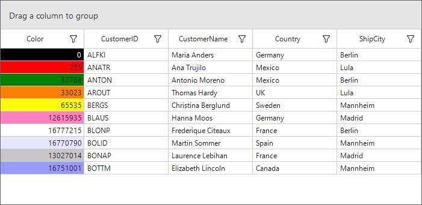

# How to change the cell background based on the cell value in WinForms DataGrid(SfDataGrid)?

## About the sample
This example illustrates how to change the cell background based on the cell value in WinForms DataGrid(SfDataGrid)?

You can apply the background color for cell based on cell value can be achieve by using [SfDataGrid.QueryCellStyle(https://help.syncfusion.com/cr/cref_files/windowsforms/Syncfusion.SfDataGrid.WinForms~Syncfusion.WinForms.DataGrid.SfDataGrid~QueryCellStyle_EV.html) event.

```C#
sfDataGrid1.QueryCellStyle += SfDataGrid1_QueryCellStyle;

private void SfDataGrid1_QueryCellStyle(object sender, Syncfusion.WinForms.DataGrid.Events.QueryCellStyleEventArgs e)
{
   if (e.Column.MappingName == "Color")
   {
       var userColourString = e.DisplayText;
       int userColourNumeric = 0;
       int.TryParse(userColourString, out userColourNumeric);
       var colourToUse = userColourNumeric;
       e.Style.BackColor = ColorTranslator.FromWin32(colourToUse);
       if (e.DisplayText == "0")
           e.Style.TextColor = Color.White;
   }
}

```



## Requirements to run the demo
Visual Studio 2015 and above versions

