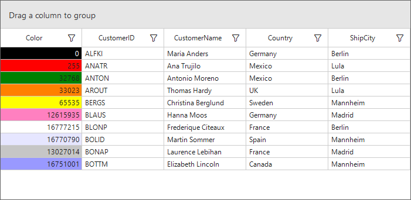

# How to Change the Cell Background Based on the Cell Value in WinForms DataGrid?

This example illustrates how to change the cell background based on the cell value in [WinForms DataGrid](https://www.syncfusion.com/winforms-ui-controls/datagrid) (SfDataGrid).

You can apply the background color for cell based on cell value can be achieve by using [SfDataGrid.QueryCellStyle](https://help.syncfusion.com/cr/windowsforms/Syncfusion.WinForms.DataGrid.SfDataGrid.html#Syncfusion_WinForms_DataGrid_SfDataGrid_QueryCellStyle) event.

```C#
sfDataGrid1.QueryCellStyle += SfDataGrid1_QueryCellStyle;

private void SfDataGrid1_QueryCellStyle(object sender, Syncfusion.WinForms.DataGrid.Events.QueryCellStyleEventArgs e)
{
   if (e.Column.MappingName == "Color")
   {
       var userColourString = e.DisplayText;
       int userColourNumeric = 0;
       int.TryParse(userColourString, out userColourNumeric);
       var colourToUse = userColourNumeric;
       e.Style.BackColor = ColorTranslator.FromWin32(colourToUse);
       if (e.DisplayText == "0")
           e.Style.TextColor = Color.White;
   }
}

```


